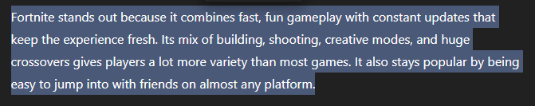
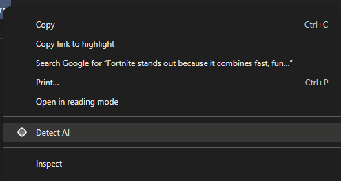
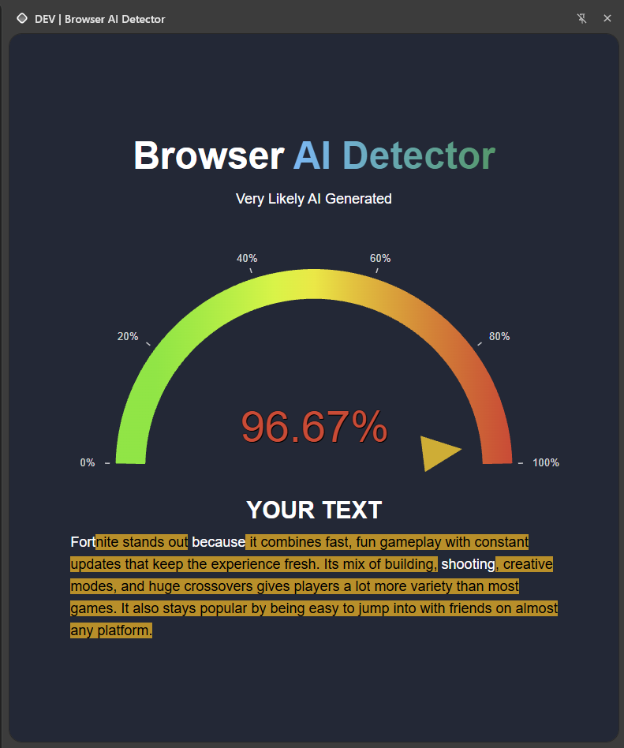
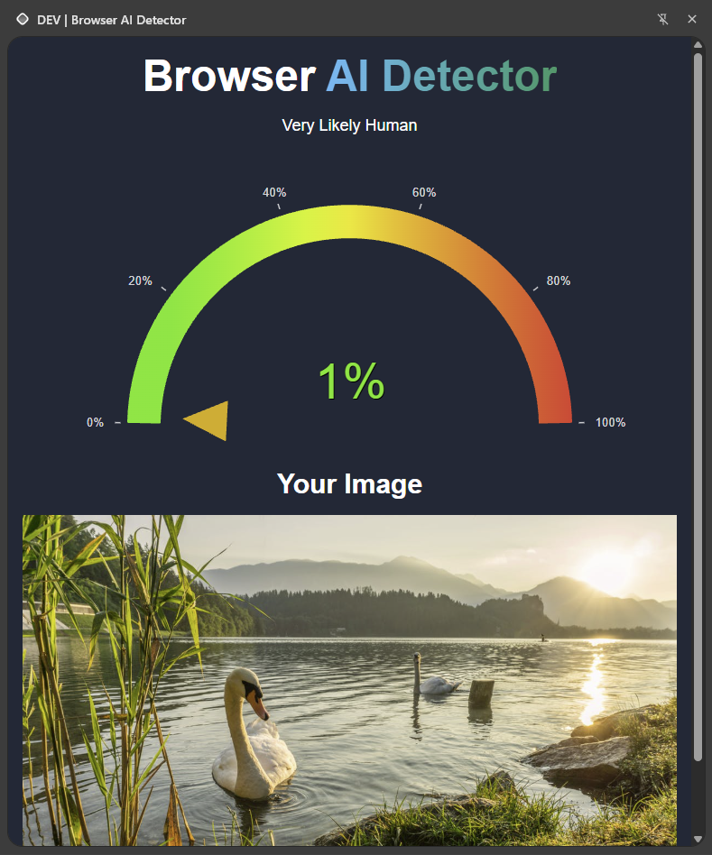

# AI Browser Extension

## How to build

Run the following:

```BASH
npm i
npm run build
```

This will create `eReuseHacks2026/browser-ai-detector/chrome-mv3-prod`

## How To Install

- Head to [chrome://extensions/](chrome://extensions/).
- Enable **Developer mode** in the top-right corner.
- Select **Load unpacked** in the top-left corner.
- Locate the folder `eReuseHacks2026/browser-ai-detector/chrome-mv3-prod` and select it.
- The extension is now installed.
- Click on the extension in the top-right of your browser for a usage guide

## How To Use

Once installed, and the backend is running, go to any website and do either of the following:

### Text

1. Highlight the text

2. Right click and select `Detect AI`

3. Get the results!


### Images

1. Right click the image and select `Detect AI`

2. Get the results!

